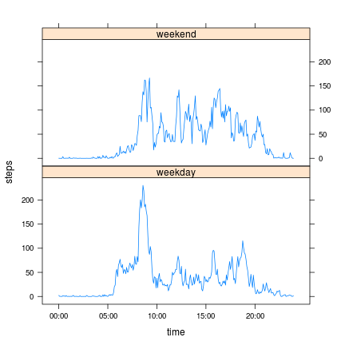

# Reproducible Research: Peer Assessment 1


## Loading and preprocessing the data
The zip file is unzipped and read as a data.table.  Then the date field is converted to Date type.  We also add a time field based the value of interval.  Note that the date part of time field is not important as we will only use its time part (within a day).

```r
opts_chunk$set(fig.width=6,fig.height=6)
library(data.table)
unzip("activity.zip")
dt <- fread("activity.csv")
```

```r
dt[,date:=as.Date(date)]
# interval is an integer with up to 4 digits, 
# with preceeding zeros removed
# the first two digits for hour, and the last two digits for minute
# convert to a Time type
dt[, time:=as.POSIXct(
  sprintf("%02d:%02d",interval%/%100,interval%%100),
  format="%H:%M")]
```


## What is mean total number of steps taken per day?
The number of steps is summed by date, then a histogram is shown and its mean and median values are calculated.

```r
# make a per day sum
dt.perday = dt[, list(total_steps=sum(steps)), by=date]
with(dt.perday, hist(total_steps))
```

 

```r
mean(dt.perday$total_steps,na.rm=TRUE)
```

```
## [1] 10766
```

```r
median(dt.perday$total_steps,na.rm=TRUE)
```

```
## [1] 10765
```


## What is the average daily activity pattern?
The daily average pattern is obtained by taking mean by interval.  Then a time-series plot is created.  We also show the interval and corresponding time of the maximum. 

```r
# make a daily average
dt.daily.avg = dt[, list(steps=mean(steps,na.rm=TRUE),time=time[1]), by=interval]
with(dt.daily.avg, plot(x=time,y=steps,type='l'))
```

 

```r
dt.daily.avg[which.max(steps),
             list(interval_of_max=interval,
                  time_of_max=strftime(time,"%H:%M:%S"))]
```

```
##    interval_of_max time_of_max
## 1:             835    08:35:00
```

## Imputing missing values
The number of NAs in each column is first examined.

```r
count.NA <- dt[,lapply(.SD, function(x) {sum(is.na(x))})]
count.NA
```

```
##    steps date interval time
## 1:  2304    0        0    0
```

```r
dt[is.na(steps), table(date)]
```

```
## date
## 2012-10-01 2012-10-08 2012-11-01 2012-11-04 2012-11-09 2012-11-10 
##        288        288        288        288        288        288 
## 2012-11-14 2012-11-30 
##        288        288
```
There are 2304 NAs in steps. Next its distribution on dates is counted.  Each day in the table contains 288 (=24*60/5) NAs, and it means all the 5-minutes measurements in that day are not available.  To impute the NAs, the daily average value of the corresponding interval is used.


```r
# make a copy, then replace the NAs
dt2 <- copy(dt)
dt2[,steps:=as.double(steps)]
# find the index of matching interval in dt.daily.avg
index <- dt2[is.na(steps),match(interval,dt.daily.avg$interval)]
# replacing NAs by daily average steps of corresponding interval
dt2[is.na(steps),steps:=dt.daily.avg$steps[index]]

# count the number days with missing data in dt
num_missing_days <- dt[is.na(steps), length(unique(date))]
```
After imputing the missing values, we re-evaluate the histogram, mean and median.  The mean is unchanged since we replace the NAs by daily averages.  The median changes slightly and move toward the mean. The central bar of histogram becomes significantly higher.  Obviously it is the contribution of the 8 missing days we added back.


```r
# make a per day sum (NAs have been replaced)
dt2.perday = dt2[, list(total_steps=sum(steps)), by=date]
with(dt2.perday, hist(total_steps))
```

 

```r
mean(dt2.perday$total_steps)
```

```
## [1] 10766
```

```r
median(dt2.perday$total_steps)
```

```
## [1] 10766
```

## Are there differences in activity patterns between weekdays and weekends?
The dates are categorized to two groups: weekday or weekend.  We calculate the daily average separately for each group.  A panel plot is produced to compare the activity patterns between weekdays and weekends.  In weekdays, the peak around 8:30 is higher.  There are also more activities between 6-8 am but less activities between 10:00-18:00.  This seems reasonable and matches to normal work time.

```r
dt2[, weekday:=factor(as.POSIXlt(date)$wday %in% c(0,6),
                      labels=c("weekday","weekend"))]
```

```r
dt2.daily.avg = dt2[, list(steps=mean(steps),time=time[1]), 
                    by=list(weekday,interval)]

# set the ticks and labels at x-axis
breaks <- seq(as.POSIXct("00:00", format="%H:%M"),by="5 hour",
              length.out=5)
labels <- strftime(breaks, format = "%H:%M")

#library(ggplot2)
#qplot(x=time, y=steps, data=dt2.daily.avg, geom=c('line')) + 
#  facet_wrap(~ weekday, nrow = 2) +
#  scale_x_datetime(breaks=breaks, labels=labels)
     
library(lattice)
xyplot(steps ~ time | weekday, data=dt2.daily.avg, 
       layout=c(1,2), type='l', 
       scales=list(x=list(at=breaks,labels=labels)))
```

 
